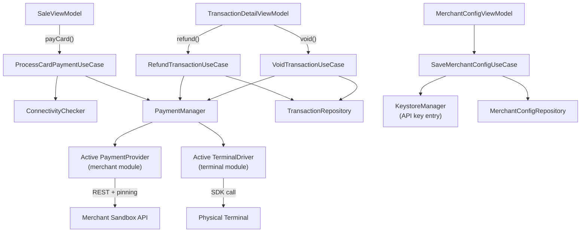

# Phase 2 — Merchant APIs + Terminal Integration: Execution Plan

## Current State (what Phase 1 left ready)

- `PaymentProvider` and `TerminalDriver` interfaces fully defined in `:core:payment-interface`
- All 7 merchant modules exist as `NotImplementedError` stubs
- All 3 terminal modules exist as `NotImplementedError` stubs
- `FakePaymentProvider` / `FakeTerminalDriver` in `:core:testing`
- Room entities + DAOs already exist: `merchant_configs`, `terminal_configs`, `refunds`
- `TransactionRepository.recordRefund()` and `updateStatus()` implemented in data layer
- `TransactionStatus.VOIDED / REFUNDED / PARTIAL_REFUND / PENDING_REFUND` in domain models
- `SaleScreen` card/split buttons disabled with "Phase 2" stubs
- Settings screen has empty `onClick` placeholders for Merchant Config and Terminal Pairing
- `KeystoreManager` exists; needs API key store/retrieve methods added

---

## Architecture Map



---

## Milestone 1 — Payment Orchestration Layer (domain + data + DI)

**Goal:** Wire the bridge between the core app and merchant/terminal modules.

### 1a. Domain additions
- **`domain/repository/MerchantConfigRepository.kt`** — `getAll()`, `getById()`, `getActive()`, `save()`, `setActive()`
- **`domain/repository/TerminalConfigRepository.kt`** — `getAll()`, `getActive()`, `save()`, `setActive()`
- **`domain/usecase/payment/ProcessCardPaymentUseCase.kt`** — checks connectivity → calls `PaymentManager.processPayment()` → calls `PaymentManager.startTerminalPayment()` → returns `Result<PaymentResponse>`
- **`domain/usecase/payment/RefundTransactionUseCase.kt`** — validates amount ≤ original, optional PIN re-verify, calls `PaymentManager.processRefund()`, updates transaction status, records `Refund` row, writes audit log
- **`domain/usecase/payment/VoidTransactionUseCase.kt`** — validates same-day, PIN confirmation, calls `PaymentManager.voidTransaction()`, updates status to `VOIDED`, writes audit log
- **`domain/usecase/payment/SaveMerchantConfigUseCase.kt`** — validates config, stores API key in Keystore, saves config row (no API key in Room)
- **`domain/usecase/payment/GetMerchantConfigUseCase.kt`** — loads config, resolves API key from Keystore alias

### 1b. Data layer
- **`data/repository/MerchantConfigRepositoryImpl.kt`** — Room impl via `MerchantConfigDao`
- **`data/repository/TerminalConfigRepositoryImpl.kt`** — Room impl via `TerminalConfigDao`
- **`KeystoreManager.kt`** — add `storeApiKey(alias, key)` + `retrieveApiKey(alias): Result<String>` methods using `EncryptedSharedPreferences` or a `SecretKey` AES entry per merchant

### 1c. PaymentManager
- **`payment/PaymentManager.kt`** (in `:app`) — injected with `Set<PaymentProvider>` and `Set<TerminalDriver>` via Hilt multibindings; resolves active merchant from `MerchantConfigRepository.getActive()` and active terminal from `TerminalConfigRepository.getActive()`; exposes `processPayment()`, `processRefund()`, `voidTransaction()`, `startTerminalPayment()`, `startTerminalRefund()`

### 1d. DI
- **`di/PaymentModule.kt`** — `@IntoSet` bindings for all 7 `PaymentProvider` impls and 3 `TerminalDriver` impls; `@Singleton` `PaymentManager`; `@Binds` for both new repository interfaces

---

## Milestone 2 — Merchant API Implementations (sandbox)

Each of the 7 modules follows the same structure. Execution order: **Worldpay → Elavon → Clover → Fiserv → First Data → Cardnet → Manya**.

### Per-merchant structure
Each module gets:
- `*ApiService.kt` — Retrofit `@interface` with all endpoints (payment, refund, void, status)
- `*ApiClient.kt` — builds `OkHttpClient` with `CertificatePinner`, auth interceptor (HMAC/Bearer depending on merchant), `HttpLoggingInterceptor` (debug only), `network_security_config` hostname allowlist
- `*RequestMapper.kt` — maps `PaymentRequest` / `RefundRequest` → merchant-specific request DTO
- `*ResponseMapper.kt` — maps merchant response DTO → `PaymentResponse` / `RefundResponse` / `VoidResponse`
- `*PaymentProvider.kt` — real implementation replacing stub; `initializeSDK()` builds the Retrofit client from `MerchantConfig`; all ops delegate to `ApiService` via mappers; error handling returns typed `Result.failure()`

### Certificate pinning
Each merchant client configures `CertificatePinner` in `*ApiClient.kt`:
```kotlin
CertificatePinner.Builder()
    .add("api.worldpay.com", "sha256/AAAA...") // real pin from sandbox cert
    .build()
```
Pins fetched from sandbox cert during integration testing. Placeholder SHA256 slots marked `// TODO: replace with real sandbox pin` until certs are obtained.

### Merchant-specific auth patterns
- **Worldpay:** `Authorization: Basic <base64(username:password)>` (WPSA)
- **Elavon Converge:** API key + `ssl_merchant_id` in request body
- **Clover:** `Authorization: Bearer <token>` (OAuth2 device auth)
- **Fiserv:** HMAC-SHA256 `Message-Signature` header
- **First Data:** HMAC-SHA256 `Message-Signature` header (same Fiserv gateway)
- **Cardnet:** Bearer token from `/auth` endpoint
- **Manya:** TBD on approval — stub with `initializeSDK()` returning `Result.failure(NotImplementedError("Manya approval pending"))`

---

## Milestone 3 — Terminal Driver Implementations

Terminal SDKs are distributed as proprietary JARs/AARs — place in each module's `libs/` folder.

### `:terminal:ingenico` (DX8000 + DX4000)
- Telium+ SDK (`teliumplus.jar`) placed in `terminal/ingenico/libs/`
- `IngenicoTerminalDriver.kt` — fix class name typo (currently `UingenicoTerminalDriver`); implement `connect()` via `TeliumManager.connectUSB()` or `connectBluetooth()`; `startPayment()` dispatches EMV/NFC intent and awaits `PaymentActivity` result via `ActivityResultLauncher`; `getConnectionStatus()` polls `TeliumManager.isConnected()`

### `:terminal:clover-flex`
- Clover SDK added as dependency (`com.clover.sdk:clover-android-sdk`)
- `CloverFlexTerminalDriver.kt` — uses `IPaymentConnector` / `ICloverConnector`; `connect()` binds to `CloverPaymentConnector`; `startPayment()` calls `connector.sale(SaleRequest)`; handles callbacks via `ICloverConnectorListener`

### `:terminal:castles` (S1000 + S1F2)
- CTOS SDK (`castles-ctos.jar`) placed in `terminal/castles/libs/`
- `CastlesTerminalDriver.kt` — connect via USB/BT; `startPayment()` calls CTOS `PaymentManager.startPayment()`; maps CTOS response codes to `TerminalPaymentResult`

### Terminal driver structure (common pattern)
Each driver manages a `StateFlow<TerminalConnectionStatus>` internally. All blocking SDK calls run in `Dispatchers.IO`. Unexpected exceptions are caught and returned as `Result.failure(TerminalException(...))`.

---

## Milestone 4 — Sale Screen: Card + Split Payment Flow

**Files to modify:**
- [`app/src/main/java/com/alphadragon/pos/ui/sale/SaleViewModel.kt`](app/src/main/java/com/alphadragon/pos/ui/sale/SaleViewModel.kt)
- [`app/src/main/java/com/alphadragon/pos/ui/sale/SaleScreen.kt`](app/src/main/java/com/alphadragon/pos/ui/sale/SaleScreen.kt)

### SaleViewModel changes
- Inject `ProcessCardPaymentUseCase`, `ConnectivityChecker`
- `payCard()` — check connectivity first; emit `CardState.CheckingConnectivity` → `CardState.WaitingForTerminal` → `CardState.Processing` → `CardState.Success` / `CardState.Failed`
- `paySplit(cashAmount)` — validate cash portion ≤ total; process card for remainder; only write transaction if both succeed
- `UiState` sealed class additions: `CardPaymentState` with sub-states
- On terminal cancel (user presses cancel on device): call `driver.cancelTransaction()`, return to idle

### SaleScreen changes
- `PaymentMethodSheet` — remove "Phase 2" disabled state; both **Card** and **Split** enabled
- Card payment sheet: show animated "Waiting for terminal..." state with cancel button
- Split payment sheet: cash amount input + auto-calculated card remainder + "Process card" button
- Offline guard: if `payCard()` emits connectivity error → bottom sheet shows "No internet. Use cash." with no retry loop

---

## Milestone 5 — Refund and Void UI

**New files:**
- `domain/usecase/payment/RefundTransactionUseCase.kt` (from M1)
- `domain/usecase/payment/VoidTransactionUseCase.kt` (from M1)
- `ui/transactions/TransactionDetailScreen.kt` — full transaction detail view with Refund and Void action buttons; applies `FLAG_SECURE`
- `ui/transactions/TransactionDetailViewModel.kt` — loads transaction + items + refunds; exposes `refund(amount)`, `void()`, both requiring PIN re-verification via `LoginUseCase.verifyPin()`
- `ui/transactions/RefundSheet.kt` — radio Full / Partial; partial shows amount input; confirm button triggers `viewModel.refund()`
- `ui/components/PinConfirmDialog.kt` (shared) — reusable 6-digit PIN re-entry dialog

**Files to modify:**
- `ui/transactions/TransactionHistoryScreen.kt` — make each row clickable → navigate to `TransactionDetailScreen`
- Navigation graph — add `transactionDetail/{transactionId}` route

### Refund logic rules
- Full refund: amount = original total; status → `REFUNDED`
- Partial refund: amount < total; status → `PARTIAL_REFUND`; multiple partial refunds allowed until sum = total
- If offline: record as `PENDING_REFUND`; `PaymentManager` skips API call; show "Refund queued — will process when connected"
- PIN re-entry required if `app_config.pin_required_for_refunds = true`

### Void logic rules
- Only offered if transaction `timestamp` is same calendar day (UTC)
- Always requires PIN confirmation
- Calls `PaymentManager.voidTransaction()` if payment was card; cash voids are local-only
- Status → `VOIDED`

---

## Milestone 6 — Settings: Merchant Config + Terminal Pairing Screens

### Merchant Config
- **`ui/settings/merchant/MerchantConfigScreen.kt`** — list of all 7 merchants; each shows active/inactive badge; tap → detail
- **`ui/settings/merchant/MerchantConfigDetailScreen.kt`** — fields: environment (SANDBOX / PRODUCTION toggle), API key (text field, `KeyboardType.Password`, never displayed after save — shows "••••• saved"), terminal ID, currency code, country code, is_active toggle; Save stores API key to Keystore (via `SaveMerchantConfigUseCase`), saves rest to Room; applies `FLAG_SECURE`
- **`ui/settings/merchant/MerchantConfigViewModel.kt`**

### Terminal Pairing
- **`ui/settings/terminal/TerminalPairingScreen.kt`** — list of 3 terminal models with connection status indicator
- **`ui/settings/terminal/TerminalPairingDetailScreen.kt`** — fields: connection type (USB / BT / TCP/IP / BUILTIN), IP address, Bluetooth address, port, display name; "Test Connection" button → calls `TerminalDriver.connect()` + shows result
- **`ui/settings/terminal/TerminalPairingViewModel.kt`**

**SettingsScreen.kt changes** — wire `onClick` for "Merchant Config" and "Terminal Pairing" to navigate to the new screens.

---

## Milestone 7 — Certificate Pinning + Permissions + Manifest

- Add `INTERNET` and `ACCESS_NETWORK_STATE` to `AndroidManifest.xml` (if not already present from Phase 1)
- Add `BLUETOOTH`, `BLUETOOTH_CONNECT`, `USB_PERMISSION` permissions
- `network_security_config.xml` — already blocks cleartext; add `<pin-set>` entries per merchant domain once real pins are obtained
- `ConnectivityChecker.kt` — thin wrapper around `ConnectivityManager.activeNetwork` returning `Boolean`; injected in `ProcessCardPaymentUseCase`

---

## Milestone 8 — Tests

Per the brief's testing requirements (section 17):

- **Unit tests per merchant module** — MockWebServer (OkHttp) serving sandbox fixture responses; test `processPayment()`, `processRefund()`, `voidTransaction()` with success + error responses
- **Unit tests for use cases** — `ProcessCardPaymentUseCase` with `FakePaymentProvider` + `FakeTerminalDriver`; `RefundTransactionUseCase` full + partial + offline + PIN cases; `VoidTransactionUseCase` same-day + different-day guard
- **Unit tests for terminal drivers** — connection state machine transitions; cancelled payment returns `Result.failure()`
- All new tests placed under each module's `src/test/` matching existing test file conventions

---

## Execution Order Summary

```
M1 → M2 (merchants in parallel) → M3 (terminals in parallel) → M4 → M5 → M6 → M7 → M8
```

M2 and M3 can overlap. M4 depends on M1 + M3. M5 depends on M1. M6 depends on M1 (KeystoreManager). M7 is a cross-cutting concern applied alongside M2.

---

## Key Files Index

| What | Where |
|------|-------|
| PaymentProvider interface | `core/payment-interface/src/.../PaymentProvider.kt` |
| TerminalDriver interface | `core/payment-interface/src/.../TerminalDriver.kt` |
| PaymentModels DTOs | `core/payment-interface/src/.../PaymentModels.kt` |
| SaleViewModel (modify) | `app/src/main/java/.../ui/sale/SaleViewModel.kt` |
| SaleScreen (modify) | `app/src/main/java/.../ui/sale/SaleScreen.kt` |
| KeystoreManager (modify) | `app/src/main/java/.../security/KeystoreManager.kt` |
| SettingsScreen (modify) | `app/src/main/java/.../ui/settings/SettingsScreen.kt` |
| PaymentManager (new) | `app/src/main/java/.../payment/PaymentManager.kt` |
| DI PaymentModule (new) | `app/src/main/java/.../di/PaymentModule.kt` |
| Worldpay impl (replace stub) | `merchant/worldpay/src/.../WorldpayPaymentProvider.kt` |
| Ingenico driver (replace stub) | `terminal/ingenico/src/.../IngenicoTerminalDriver.kt` |
